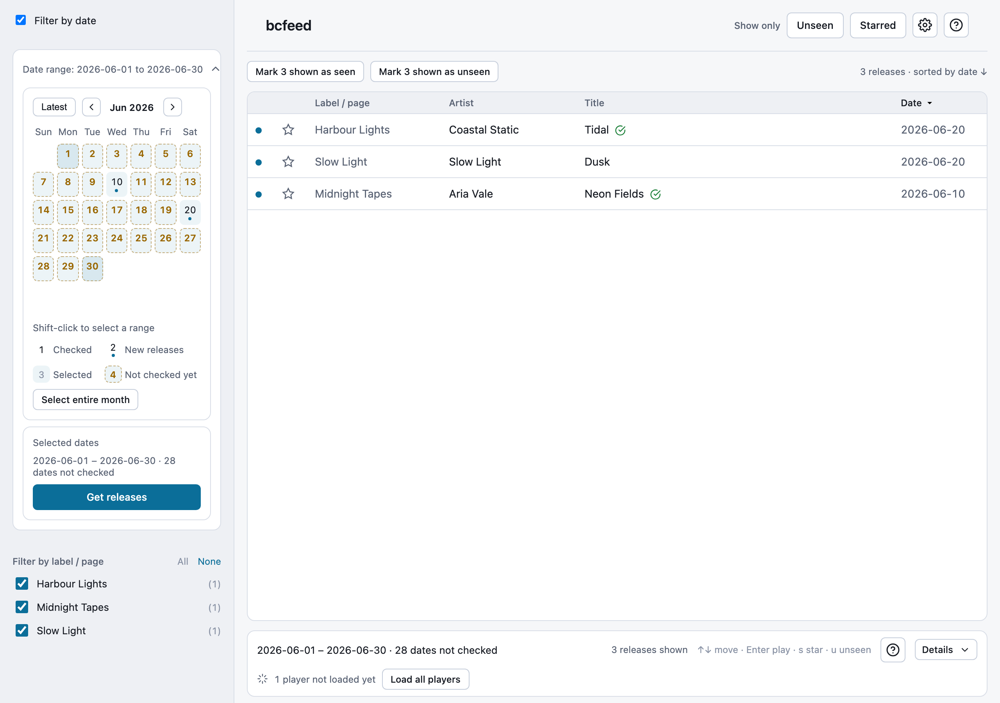
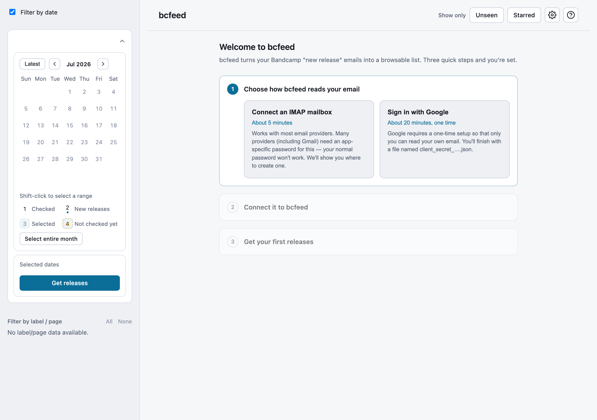

# bcfeed

## Introduction

**bcfeed** is a local macOS app that turns your Bandcamp "New release from..." notification emails into a browsable dashboard of releases.

It works by searching your email account within a given date range for Bandcamp release notification emails, then saving the release details locally so you can sort, filter, and preview them.

You can connect either:

- a Gmail account using the Gmail API and your own Google access file
- any IMAP-compatible mailbox by entering the server details in the Settings panel

## Setup

See [SETUP.md](SETUP.md) to install and run **bcfeed**. The first time you launch it, a short checklist walks you through connecting your email:

- Google sign-in (Gmail): [GMAIL_SETUP.md](GMAIL_SETUP.md)
- Mail server (IMAP): [IMAP_SETUP.md](IMAP_SETUP.md)

## Workflow

**A typical workflow would be:**

1) **Select a date range on the calendar**, e.g. the whole of last December.
2) Click **"Get releases"**. This searches your email for Bandcamp release notifications within the selected dates and saves the results locally. If a range is already checked, the button becomes **"Check again"** so you can re-check the same dates.
3) Now you can do one of three things:
  - **Browse straight away** - this works! However, the first time you open each release its player and details are loaded from its Bandcamp page, which takes a few seconds. For smoother browsing, you can
  - Let **bcfeed load the players in the background** - it does this automatically at a polite pace for the dates you're viewing. Or you can
  - **"Star" the releases you're interested in, then filter and browse the starred releases using the "Starred" button at the top right**. Starring a release loads its player first, so by the time you click "Starred", it should already be ready.
4) If you like, once you've browsed that date range, you can mark the shown releases as "Seen" (in the left panel).

## Notes

Once you've checked (or browsed) a date range from your mailbox once, you don't have to do it again. Each line in the saved list corresponds to an *email* in your inbox. So if you've already checked a date range in the past, that's all the releases (emails) you'll ever see in that date range. If you do want to look again, use **"Check again"**.

You can turn on a small "Saved" tag next to releases whose player is ready ("Show 'player ready' tags" in Settings).

The Settings panel at the top right lets you choose how bcfeed reads your email, connect or disconnect Gmail, enter your IMAP mail settings, and delete downloaded data.

Your Gmail sign-in and IMAP password are kept in your Mac's Keychain.

## Keyboard shortcuts

**bcfeed** has a fast keyboard triage loop for working through releases. The same list is available in the app from the **?** button next to the table.

| Keys | Action |
|---|---|
| `↑` `↓` | Move between releases |
| `←` `→` `↑` `↓` | Move around the calendar |
| `Enter` / `Space` | Play a release / pick a date |
| `Shift` + `Enter` | Extend the date range |
| `Home` / `End` | Jump across a calendar week |
| `s` | Star the focused release |
| `u` | Mark the focused release unseen |
| `Esc` | Close the open player or dialog |

## Performance

### Why are releases loading so slowly?

Make sure to read the bit above about loading players in the background.

Typically it's pretty quick to get releases from Gmail - a few hundred emails should take a few seconds. IMAP accounts can take a bit longer and it depends on your mail service, though ~100 emails should typically not take much longer than a minute. However, Bandcamp release notification emails only contain basic metadata (artist, title, label/page, Bandcamp URL). Loading the Bandcamp player and release details means reading the Bandcamp page for each release, which is much slower (a few seconds per release). Naturally, you are also at the mercy of the Bandcamp servers at any given moment – it's not uncommon for them to slow to a crawl.

In general it's better to let the players load ahead of time, either by leaving bcfeed running on the dates you're browsing or by starring the releases you care about.

The good news is that **bcfeed** saves the release list, release details, and Bandcamp players locally and these persist across **bcfeed** sessions, so you only need to load each release once.

## Requirements

**bcfeed** has mainly been tested on recent macOS and Chrome. It probably works on other macOS versions. It may or may not work on other browsers. It probably won't work on Windows, but feel free to try.

**bcfeed** supports:
- Gmail accounts via the Gmail API and your own Google access file
- IMAP-compatible accounts via the Settings panel

Some email services require IMAP to be enabled and/or an app-specific password. bcfeed also needs your Mac's Keychain (built into macOS) to save your sign-in.

## Privacy

**bcfeed** runs entirely on your local machine. It collects no analytics or telemetry, and the author never has access to your sign-in details or email data. For the full details, see [privacy.md](privacy.md).

## License

**bcfeed** is released under the MIT License. See [LICENSE](LICENSE).
